<h2 align="center">WEBSITE BÁN CÀ PHÊ</h2>
 
<h4>1. Đặt vấn đề</h4>

Ngày nay đời sống của người dân đã được cải thiện thu nhập tăng lên, nên nhu cầu giải trí uống cà phê cũng khác trước. Ngày trước uống cà phê chỉ đơn thuần là việc giải khát nhưng nhu cầu đã cao hơn. Vì vậy, trong cuộc sống bận rộn vì công việc hằng ngày, mỗi người thường chọn cho mình một kiểu thư giãn riêng như: thưởng thức không gian quán, tìm ý sáng tạo, thể thao, … Song, thưởng thức cà phê vẫn được nhiều người ưa chuộng nhất. Ngày nay, người ta không chỉ uống cà phê để giải khát mà còn là đi tìm hương vị ngon của từng loại cà phê phù hợp với bản thân, tự tay pha chế ra những ly cà phê thơm ngon để có thể tư giản, giảm áp lực, căng thẳng, gặp gỡ trao đổi công việc, chia sẻ với nhau,… Đứng về phía góc nhìn của nhà kinh doanh, với một thị trường cà phê đa dạng và phổ biến như hiện nay một câu hỏi đặt ra là: Cần làm gì để thu hút khách hàng chú ý đến thương hiệu của mình, tất nhiên là ngoài chất lượng dịch vụ – thức uống của cửa hàng thì điều quan trọng là cần phải đầu tư vào việc quảng cáo hình ảnh thương hiệu, cụ thể cần một chiến dịch marketing online hiệu quả để tiếp cận được nhiều khách hàng hơn, cũng như website thể hiện hình ảnh thương hiệu giúp khách hàng có ấn tượng đồng thời tạo sự chuyên nghiệp trong kinh dịch vụ và cửa hàng.

 
<h4>2. Công nghệ được sử dụng:</h4>

Một số công nghệ để phục vụ cho việc triển khai đề tài, bao gồm:  
-	Ngôn ngữ: HTML, CSS, Javascript, PHP. 
-   Framework: ReactJS, Laravel 
-	Database: MySQL. 
-	Công cụ quản lý mã nguồn: Github. 

 
<h4>3. Một số hình ảnh về website</h4>
<h4>3.1 Giao diện client</h4>
<h4>3.1.1 Trang chủ</h4>

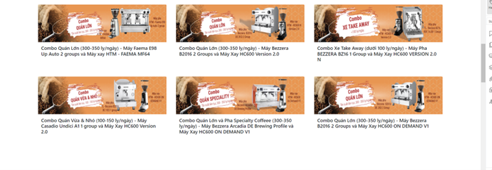
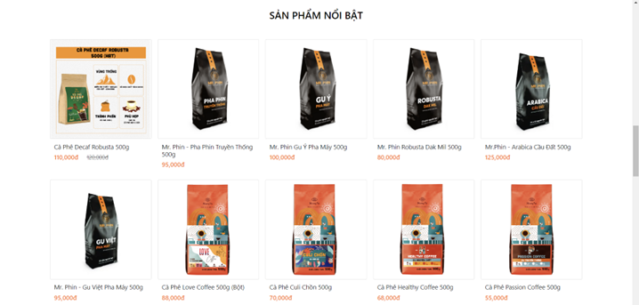
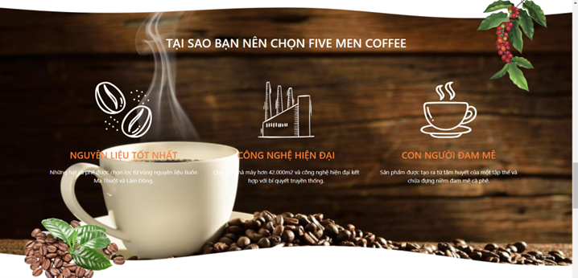

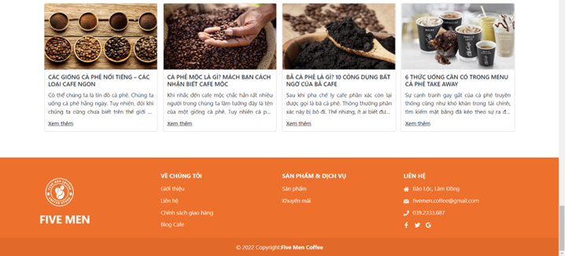
<h4>3.1.2 Đăng ký</h4>
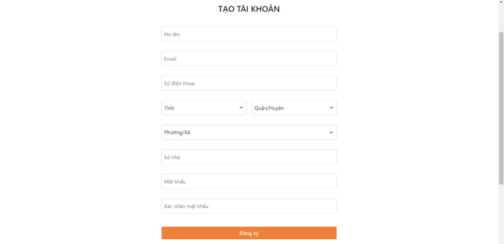
<h4>3.1.3 Đăng nhập</h4>
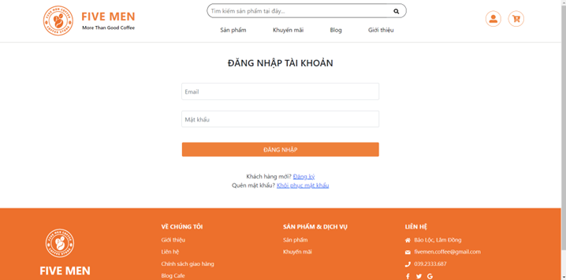
<h4>3.1.4 Quên mật khẩu</h4>
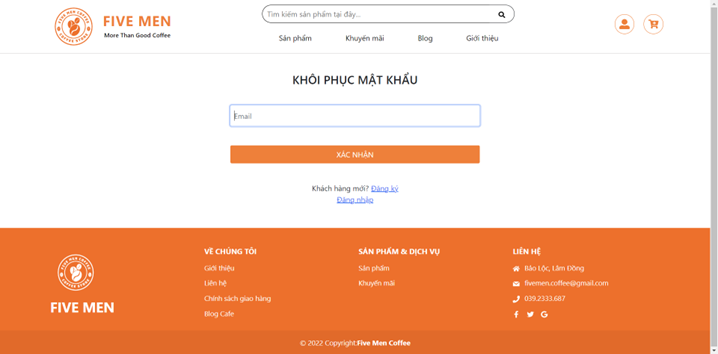
<h4>3.1.5 Giới thiệu</h4>
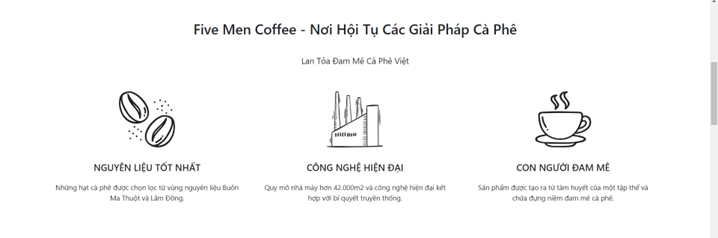
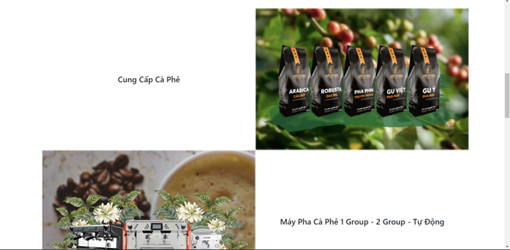
<h4>3.1.6 Sản phẩm</h4>
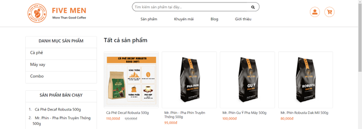
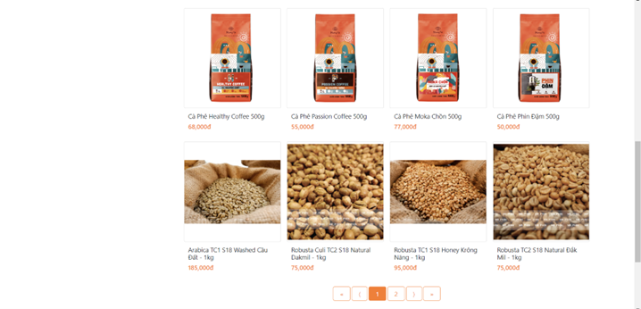
<h4>3.1.7 Chi tiết sản phẩm</h4>
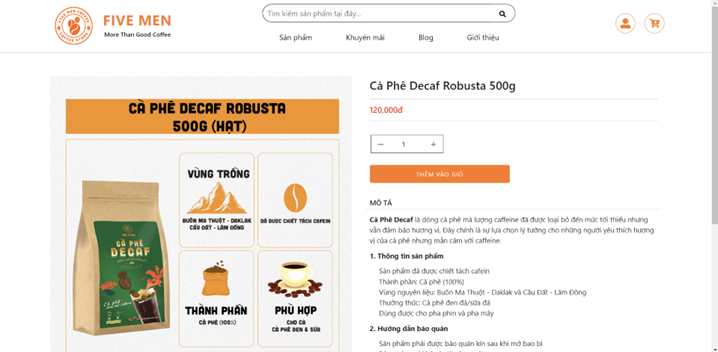
<h4>3.1.8 Giỏ hàng</h4>
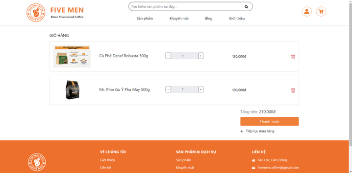
<h4>3.1.9 Đặt hàng</h4>
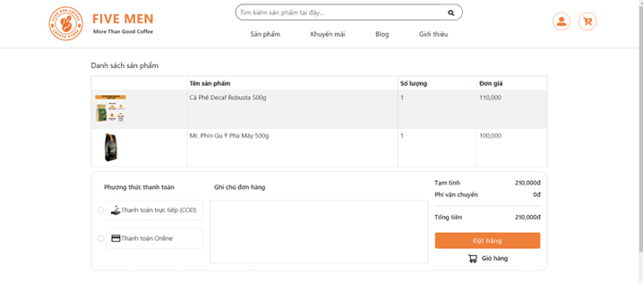
<h4>3.1.10 Thông tin tài khoản</h4>
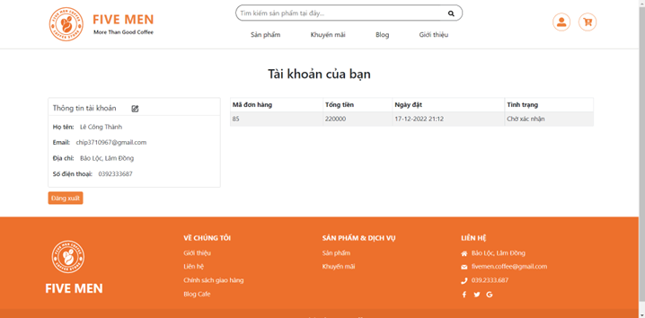
<h4>3.1.11 Tìm kiếm sản phẩm</h4>
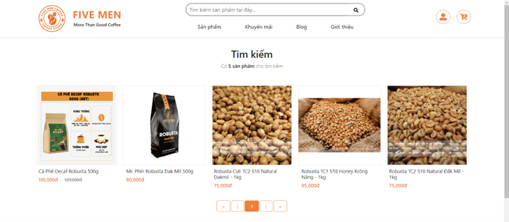
<h4>3.1.12 Khuyến mãi</h4>
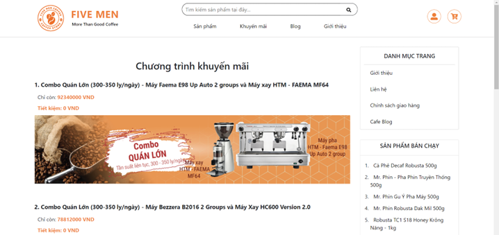
<h4>3.1.13 Tin tức</h4>
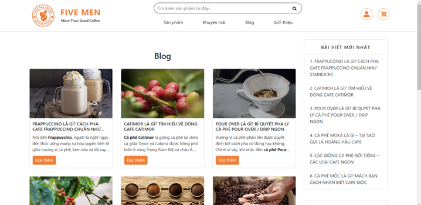
<h4>3.1.14 Chi tiết tin tức</h4>
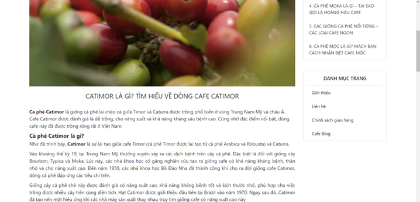
<h4>3.1.15 Liên hệ</h4>
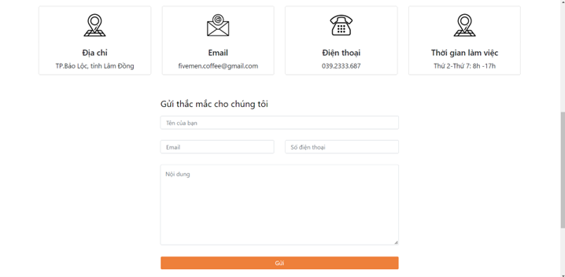

<h4>3.2 Giao diện admin</h4>
<h4>3.2.1 Đăng nhập</h4>
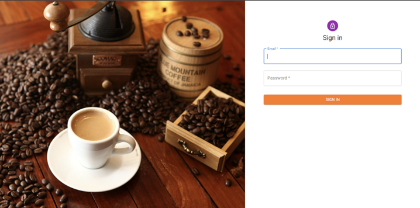
<h4>3.2.1 Đăng nhập</h4>

<h4>3.2.2 Trang chủ</h4>

<h4>3.2.3 Danh sách tài khoản</h4>
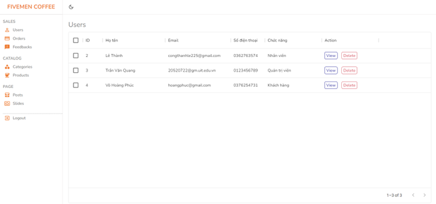
<h4>3.2.4 Xem tài khoản</h4>
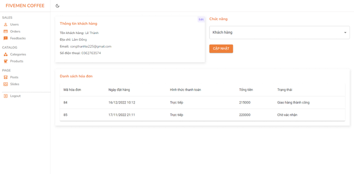
<h4>3.2.5 Danh sách hóa đơn</h4>
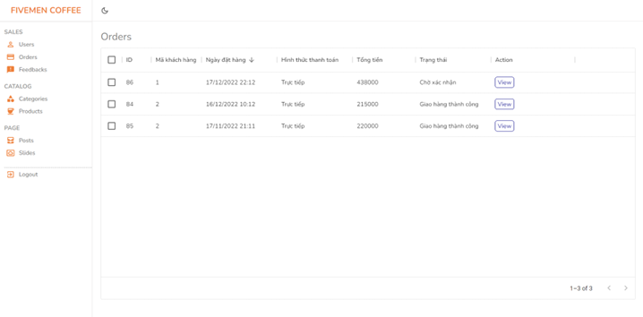
<h4>3.2.6 Xem hóa đơn</h4>

<h4>3.2.7 Danh sách phản hồi</h4>
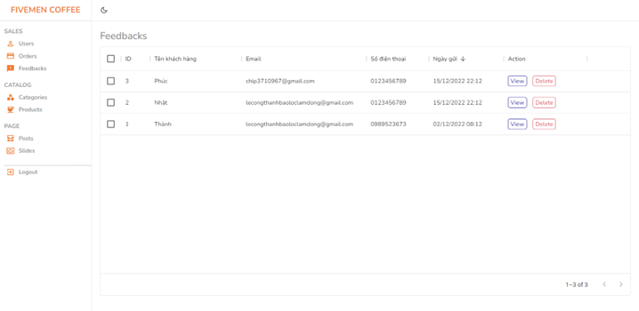
<h4>3.2.8 Xem phản hồi</h4>
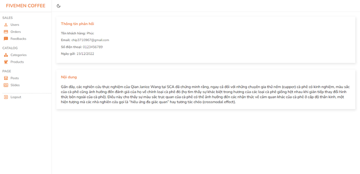
<h4>3.2.9 Danh sách loại sản phẩm</h4>
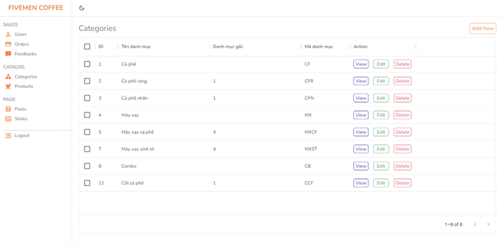
<h4>3.2.10 Thêm loại sản phẩm</h4>
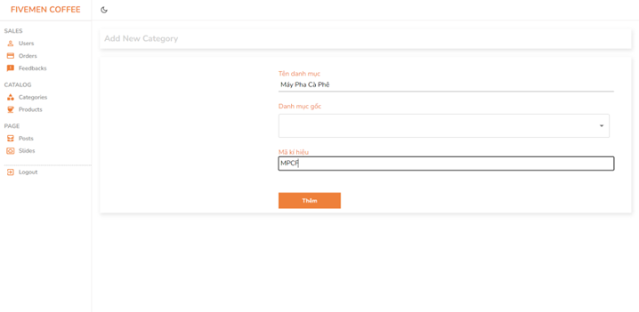
<h4>3.2.11 Cập nhật loại sản phẩm</h4>
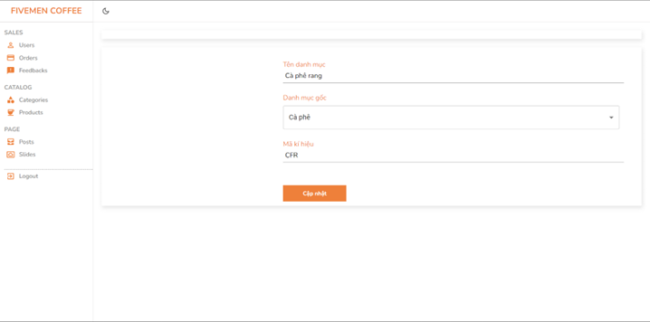
<h4>3.2.12 Danh sách sản phẩm</h4>
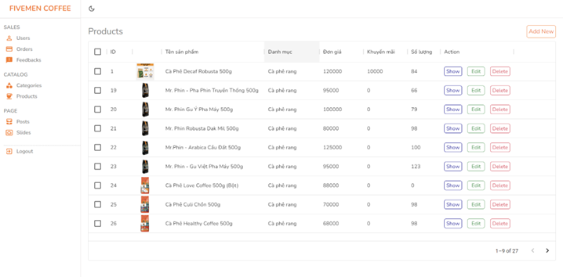
<h4>3.2.13 Thêm sản phẩm</h4>
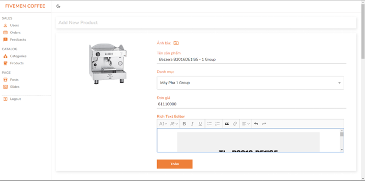
<h4>3.2.14 Cập nhật sản phẩm</h4>
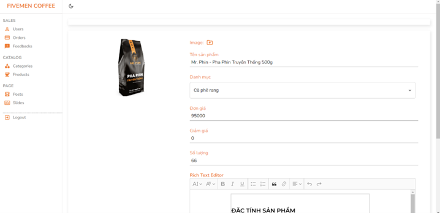
<h4>3.2.15 Danh sách tin tức</h4>
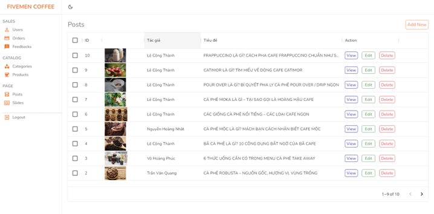
<h4>3.2.16 Thêm tin tức</h4>

<h4>3.2.17 Cập nhật tin tức</h4>
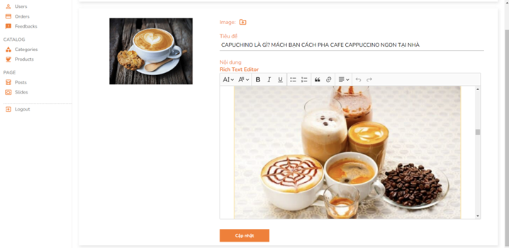
<h4>3.2.18 Danh sách slider</h4>
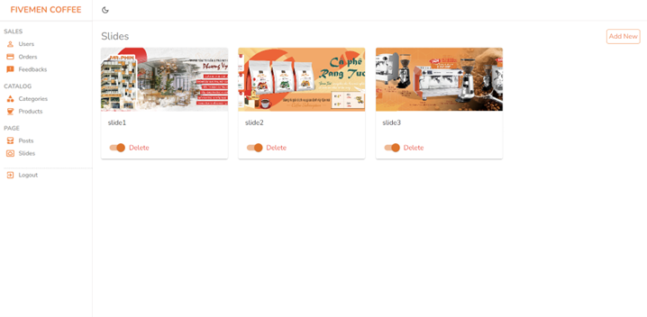
<h4>3.2.19 Thêm slider</h4>
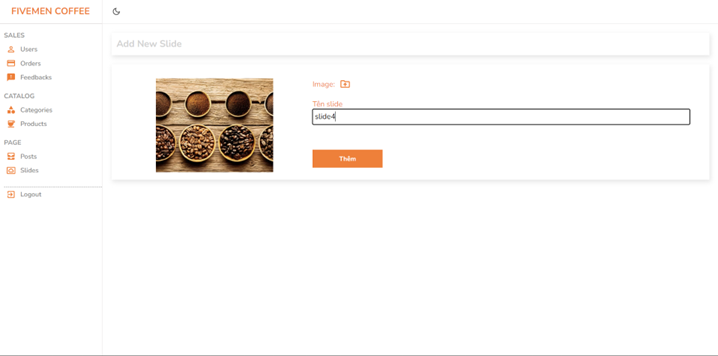